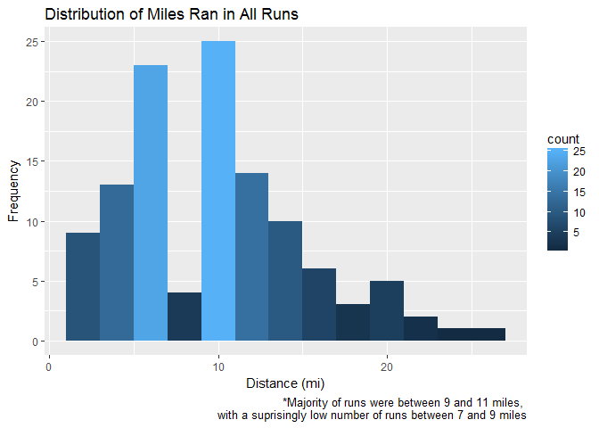

Marathon Training Plan Data Analysis
================
Steve Newns
February 24, 2017

*Initial Data Inspection*
=========================

Strava Data File
----------------

load in the CSV file containing the Strava data file created by and downloaded from **VeloViewer.com** and check out the dataset.

``` r
runs <- read.csv("cleanedMarathonTrainingData.csv")
str(runs)
```

    ## 'data.frame':    116 obs. of  19 variables:
    ##  $ X             : int  12 15 94 4 6 8 13 16 95 5 ...
    ##  $ ID            : int  646029304 647216014 648410753 649445500 650512799 651933678 653912805 655096239 656203325 657259723 ...
    ##  $ Name          : Factor w/ 13 levels "10k Tune Up Run",..: 2 7 10 3 10 4 3 7 10 7 ...
    ##  $ Gear          : Factor w/ 4 levels "ASICS dunno Black, Yellow, Red",..: 2 2 1 2 1 2 2 2 1 2 ...
    ##  $ Date          : Factor w/ 116 levels "2016-07-19","2016-07-20",..: 1 2 3 4 5 6 7 8 9 10 ...
    ##  $ Month         : Factor w/ 5 levels "Aug","Jul","Nov",..: 2 2 2 2 2 2 2 2 2 2 ...
    ##  $ monthNum      : int  7 7 7 7 7 7 7 7 7 7 ...
    ##  $ DOW           : Factor w/ 7 levels "Fri","Mon","Sat",..: 6 7 5 1 3 4 6 7 5 1 ...
    ##  $ StartTime     : Factor w/ 89 levels "10:01","10:09",..: 57 50 66 45 70 75 45 36 63 35 ...
    ##  $ Distance      : num  9.01 11 4 11 6 ...
    ##  $ Time          : Factor w/ 114 levels "2017-03-08 00:07:43",..: 50 69 14 74 31 103 59 87 6 83 ...
    ##  $ Speed.mph     : num  3.72 3.54 3.29 3.49 3.33 ...
    ##  $ Cad           : num  168 168 171 176 174 ...
    ##  $ Elevation.Gain: int  351 461 NA 468 230 572 400 485 NA 477 ...
    ##  $ Avg.HR        : int  149 150 139 150 131 154 150 146 134 149 ...
    ##  $ Max.HR        : int  167 160 149 161 155 165 159 158 142 160 ...
    ##  $ Calories      : int  943 1176 442 1170 721 1653 1090 1318 314 1241 ...
    ##  $ RunType       : Factor w/ 5 levels "Long Run","Race",..: 5 4 3 4 3 1 4 4 3 4 ...
    ##  $ Avg.Pace      : Factor w/ 67 levels "2017-03-08 00:06:32",..: 13 32 57 38 55 39 33 41 48 49 ...

remove 1st col
==============

``` r
runs$X <- NULL
head(runs,2)
```

    ##          ID           Name                   Gear       Date Month
    ## 1 646029304 Classic LT Run Brooks Ghost Red/Black 2016-07-19   Jul
    ## 2 647216014         ML Run Brooks Ghost Red/Black 2016-07-20   Jul
    ##   monthNum DOW StartTime Distance                Time Speed.mph   Cad
    ## 1        7 Tue      5:51     9.01 2017-03-08 01:04:59    3.7179 168.4
    ## 2        7 Wed      5:36    11.00 2017-03-08 01:23:29    3.5350 168.4
    ##   Elevation.Gain Avg.HR Max.HR Calories RunType            Avg.Pace
    ## 1            351    149    167      943 Workout 2017-03-08 00:07:13
    ## 2            461    150    160     1176     Run 2017-03-08 00:07:35

can't save POSIXct into CSV, must change here
=============================================

``` r
runs$Time <- as.POSIXct(runs$Time)#, format = '%H:%M:%S')
runs$Avg.Pace <- as.POSIXct(runs$Avg.Pace)#, format = '%H:%M:%S')
str(runs)
```

    ## 'data.frame':    116 obs. of  18 variables:
    ##  $ ID            : int  646029304 647216014 648410753 649445500 650512799 651933678 653912805 655096239 656203325 657259723 ...
    ##  $ Name          : Factor w/ 13 levels "10k Tune Up Run",..: 2 7 10 3 10 4 3 7 10 7 ...
    ##  $ Gear          : Factor w/ 4 levels "ASICS dunno Black, Yellow, Red",..: 2 2 1 2 1 2 2 2 1 2 ...
    ##  $ Date          : Factor w/ 116 levels "2016-07-19","2016-07-20",..: 1 2 3 4 5 6 7 8 9 10 ...
    ##  $ Month         : Factor w/ 5 levels "Aug","Jul","Nov",..: 2 2 2 2 2 2 2 2 2 2 ...
    ##  $ monthNum      : int  7 7 7 7 7 7 7 7 7 7 ...
    ##  $ DOW           : Factor w/ 7 levels "Fri","Mon","Sat",..: 6 7 5 1 3 4 6 7 5 1 ...
    ##  $ StartTime     : Factor w/ 89 levels "10:01","10:09",..: 57 50 66 45 70 75 45 36 63 35 ...
    ##  $ Distance      : num  9.01 11 4 11 6 ...
    ##  $ Time          : POSIXct, format: "2017-03-08 01:04:59" "2017-03-08 01:23:29" ...
    ##  $ Speed.mph     : num  3.72 3.54 3.29 3.49 3.33 ...
    ##  $ Cad           : num  168 168 171 176 174 ...
    ##  $ Elevation.Gain: int  351 461 NA 468 230 572 400 485 NA 477 ...
    ##  $ Avg.HR        : int  149 150 139 150 131 154 150 146 134 149 ...
    ##  $ Max.HR        : int  167 160 149 161 155 165 159 158 142 160 ...
    ##  $ Calories      : int  943 1176 442 1170 721 1653 1090 1318 314 1241 ...
    ##  $ RunType       : Factor w/ 5 levels "Long Run","Race",..: 5 4 3 4 3 1 4 4 3 4 ...
    ##  $ Avg.Pace      : POSIXct, format: "2017-03-08 00:07:13" "2017-03-08 00:07:35" ...

can't save ordered factors in CSV, must change here
===================================================

``` r
runs$Month <- factor(runs$Month, ordered = TRUE, levels = c("Jul","Aug","Sep","Oct","Nov"))
class(runs$Month)
```

    ## [1] "ordered" "factor"

load ggplot2 + make histogram
=============================

``` r
library(ggplot2)

#distance histogram
ggplot(data = runs, aes(x = Distance)) + 
  geom_histogram(binwidth = 2, aes(fill = ..count..)) + 
  xlab("Distance (mi)") + 
  ylab("Frequency") + 
  ggtitle("Distribution of Miles Ran in All Runs") + 
  labs(caption="*Majority of runs were between 9 and 11 miles, 
       with a suprisingly low number of runs between 7 and 9 miles")
```



``` r
#check data
tapply(runs$Distance,runs$Month,sum)
```

    ##    Jul    Aug    Sep    Oct    Nov 
    ## 118.08 250.08 308.14 304.45 168.44

miles by month bars
===================

``` r
ggplot(data = runs, aes(x = Month, y = Distance, fill = Month)) + 
  geom_bar(stat="identity") +
  xlab("Month") + 
  ylab("Total Miles") + 
  #coord_flip() + 
  #scale_x_discrete(limits = rev(levels(runs$Month))) +
  #geom_text(vjust=0, colour="red") +
  ggtitle("Sum of Miles by Month") + 
  labs(caption="*The largest number of miles ran, 308 miles, was in September")
```


avg. cadence grouped by month
=============================

``` r
ggplot(data = runs, aes(Month, Cad)) + 
  geom_jitter(aes(colour = Month)) +
  geom_boxplot(aes(fill = Month), 
               outlier.colour = "black", alpha = 0.5) + #geom_jitter()
  xlab("Month") + 
  ylab("Cadence") + 
  ggtitle("Cadence per Month") + 
  labs(caption="*Cadence generally increases month over month, due to more workouts, or improved form?")
```


avg. HR grouped by month
========================

``` r
ggplot(data = runs, aes(Month, Avg.HR)) + 
  geom_jitter(aes(colour = Month)) +
  geom_boxplot(aes(fill = Month), 
               outlier.colour = "black", alpha = 0.5) + #geom_jitter()
  xlab("Month") + 
  ylab("Cadence") + 
  ggtitle("Cadence per Month") + 
  labs(caption="*HR generally decreases month over month --> increased fitness or cooler weather?")
```


``` r
#tbl <- tapply(runs$Avg.HR,runs$Month,median)
```

average heart rate per run over plan --&gt; line
================================================

``` r
ggplot(data = runs, aes(x = Date, y = Avg.HR)) + 
  geom_line(aes(group=1)) +
  theme(axis.text.x = element_blank()) +
  xlab("Time") + 
  ylab("Average Heart Rate") + 
  ggtitle("Average Heart Rate Over Time") + 
  labs(caption="*Very slight general decrease, with outliers of about 100 in the 1st third of the plan and 
70 in the last 3rd of the plan")
```


average pace over plan line
===========================

``` r
ggplot(data = runs, aes(x = Date, y = Avg.Pace)) + 
  geom_point() + # by color? 
  #?stat_smooth() + 
  theme(axis.text.x = element_blank()) +
  xlab("Time") + 
  ylab("Average Heart Rate") + 
  ggtitle("Average Heart Rate Over Time") + 
  labs(caption="*Very slight general decrease, but not linear")
```


