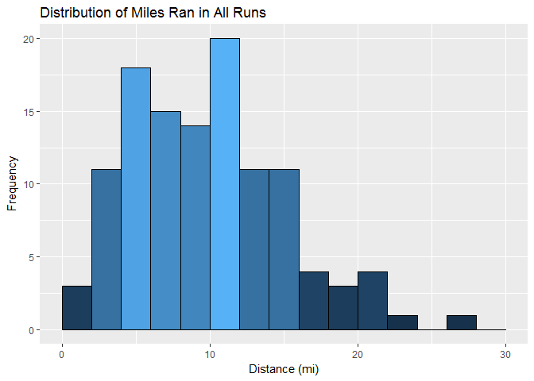

Marathon Training Plan Data Analysis
================

*Initial Data Inspection*
=========================

First, I load in the CSV file created in the **R\_Cleaning\_Garmin\_Strava** script file, which contains the combined dataset of runs from my Philadelphia Marathon training plan from both Strava and Garmin Connect. I then inspect the data to make sure I have all the correct data in the correct data types.

``` r
str(runs)
```

    ## 'data.frame':    116 obs. of  20 variables:
    ##  $ X             : int  12 15 94 4 6 8 13 16 95 5 ...
    ##  $ ID            : int  646029304 647216014 648410753 649445500 650512799 651933678 653912805 655096239 656203325 657259723 ...
    ##  $ Name          : Factor w/ 13 levels "10k Tune Up Run",..: 2 7 10 3 10 4 3 7 10 7 ...
    ##  $ Gear          : Factor w/ 4 levels "ASICS dunno Black, Yellow, Red",..: 2 2 1 2 1 2 2 2 1 2 ...
    ##  $ Date          : Factor w/ 116 levels "2016-07-19","2016-07-20",..: 1 2 3 4 5 6 7 8 9 10 ...
    ##  $ Month         : Factor w/ 5 levels "Aug","Jul","Nov",..: 2 2 2 2 2 2 2 2 2 2 ...
    ##  $ monthNum      : int  7 7 7 7 7 7 7 7 7 7 ...
    ##  $ DOW           : Factor w/ 7 levels "Fri","Mon","Sat",..: 6 7 5 1 3 4 6 7 5 1 ...
    ##  $ StartTime     : Factor w/ 89 levels "10:01","10:09",..: 57 50 66 45 70 75 45 36 63 35 ...
    ##  $ Distance      : num  9.01 11 4 11 6 ...
    ##  $ Time          : Factor w/ 114 levels "2017-03-29 00:07:43",..: 50 69 14 74 31 103 59 87 6 83 ...
    ##  $ Speed.mph     : num  3.72 3.54 3.29 3.49 3.33 ...
    ##  $ Cad           : num  168 168 171 176 174 ...
    ##  $ Elevation.Gain: int  351 461 NA 468 230 572 400 485 NA 477 ...
    ##  $ Avg.HR        : int  149 150 139 150 131 154 150 146 134 149 ...
    ##  $ Max.HR        : int  167 160 149 161 155 165 159 158 142 160 ...
    ##  $ Calories      : int  943 1176 442 1170 721 1653 1090 1318 314 1241 ...
    ##  $ RunType       : Factor w/ 5 levels "Long Run","Race",..: 5 4 3 4 3 1 4 4 3 4 ...
    ##  $ weekNumber    : int  1 1 1 1 1 1 2 2 2 2 ...
    ##  $ Avg.Pace      : Factor w/ 67 levels "2017-03-29 00:06:32",..: 13 32 57 38 55 39 33 41 48 49 ...

Well, to start off, I have a column which seems to contain the row numbers from the CSv, so let's remove that before going back to the inspection.

    ##          ID           Name                   Gear       Date Month
    ## 1 646029304 Classic LT Run Brooks Ghost Red/Black 2016-07-19   Jul
    ## 2 647216014         ML Run Brooks Ghost Red/Black 2016-07-20   Jul
    ##   monthNum DOW StartTime Distance                Time Speed.mph   Cad
    ## 1        7 Tue      5:51     9.01 2017-03-29 01:04:59    3.7179 168.4
    ## 2        7 Wed      5:36    11.00 2017-03-29 01:23:29    3.5350 168.4
    ##   Elevation.Gain Avg.HR Max.HR Calories RunType weekNumber
    ## 1            351    149    167      943 Workout          1
    ## 2            461    150    160     1176     Run          1
    ##              Avg.Pace
    ## 1 2017-03-29 00:07:13
    ## 2 2017-03-29 00:07:35

Alright, cool. But it looks like my Date field, **Date**, total run time field, **Time**, and average pace (min/mile) field, **Avg.Pace**, are not in the POSIXct format needed. So let's put them back into the correct format the lubridate package.

    ## 
    ## Attaching package: 'lubridate'

    ## The following object is masked from 'package:base':
    ## 
    ##     date

``` r
runs$Time <- as.POSIXct(runs$Time)#, format = '%H:%M:%S')
runs$Avg.Pace <- as.POSIXct(runs$Avg.Pace)#, format = '%H:%M:%S')
runs$Date <- as.POSIXct(runs$Date)
runs$StartTime <- hour(strptime(runs$StartTime, format = '%H:%M'))

str(runs)
```

    ## 'data.frame':    116 obs. of  19 variables:
    ##  $ ID            : int  646029304 647216014 648410753 649445500 650512799 651933678 653912805 655096239 656203325 657259723 ...
    ##  $ Name          : Factor w/ 13 levels "10k Tune Up Run",..: 2 7 10 3 10 4 3 7 10 7 ...
    ##  $ Gear          : Factor w/ 4 levels "ASICS dunno Black, Yellow, Red",..: 2 2 1 2 1 2 2 2 1 2 ...
    ##  $ Date          : POSIXct, format: "2016-07-19" "2016-07-20" ...
    ##  $ Month         : Factor w/ 5 levels "Aug","Jul","Nov",..: 2 2 2 2 2 2 2 2 2 2 ...
    ##  $ monthNum      : int  7 7 7 7 7 7 7 7 7 7 ...
    ##  $ DOW           : Factor w/ 7 levels "Fri","Mon","Sat",..: 6 7 5 1 3 4 6 7 5 1 ...
    ##  $ StartTime     : int  5 5 6 5 7 8 5 5 6 5 ...
    ##  $ Distance      : num  9.01 11 4 11 6 ...
    ##  $ Time          : POSIXct, format: "2017-03-29 01:04:59" "2017-03-29 01:23:29" ...
    ##  $ Speed.mph     : num  3.72 3.54 3.29 3.49 3.33 ...
    ##  $ Cad           : num  168 168 171 176 174 ...
    ##  $ Elevation.Gain: int  351 461 NA 468 230 572 400 485 NA 477 ...
    ##  $ Avg.HR        : int  149 150 139 150 131 154 150 146 134 149 ...
    ##  $ Max.HR        : int  167 160 149 161 155 165 159 158 142 160 ...
    ##  $ Calories      : int  943 1176 442 1170 721 1653 1090 1318 314 1241 ...
    ##  $ RunType       : Factor w/ 5 levels "Long Run","Race",..: 5 4 3 4 3 1 4 4 3 4 ...
    ##  $ weekNumber    : int  1 1 1 1 1 1 2 2 2 2 ...
    ##  $ Avg.Pace      : POSIXct, format: "2017-03-29 00:07:13" "2017-03-29 00:07:35" ...

Looks like **Month** was also not loaded as on *ordered* factor like I need it. As it is now, if I used it in my graphs, it would be ordereded alphabetically, not chronologically like I need it. So let's convert it back to an ordered factor with the correctly-specified ordering via the **levels** argument.

``` r
runs$Month <- factor(runs$Month, ordered = TRUE, levels = c("Jul","Aug","Sep","Oct","Nov"))
```

Now its time to acually make some plots. I'll start off with a simple histogram of how many miles I ran in each of my runs.



It looks like the majority of my runs (20 of 'em) were between 10 and 12 miles, with the next highest frequency being from 4 to 6 miles, which were mostly recovery runs, showing that there was indeed a lot decent amount of time for recovery in this plan. We can also see my one 24 mile run all the way to the right, my longest Long Run of the plan. So this distribution is right/positively-skewed, with the majority of the runs being, looking at this plot, less than 12 miles. Let's look at the summary of this data.

``` r
summary(runs$Distance)
```

    ##    Min. 1st Qu.  Median    Mean 3rd Qu.    Max. 
    ##   1.000   6.000  10.000   9.907  13.000  26.270

So, since we have a skewed distribution, we want to look at median as our measure of center. We can see the median number of miles I ran in a run is 10 miles, which is less than half of an actual marathon (mean is also basically 10, as well, just to note). So the majority of my runs seem pretty short, compared to the goal distance. This is because the point of a training plan is to get the body to adapt to a high volume of miles, but then to spread it over a period of time so that we can recover properly. We can also see the max distance here is the actual marathon. Now let's look at the total number of miles ran each month, with a pretty obvious expectation to see the total rise month-by-month.


The largest number of miles ran, 308 miles, was in September, and then we see a *ever-so-slight* drop to 304 miles in October. This could be possibly so if my peak mileage week was in September. We then see a large drop from October to November, which was expected due tapering up the race and the fact that the race was on November 20th, so there's no more run data after that date.


Welp, I was half wrong about that I guess. It seems peak week, week 11, was actually both in September *and* October.

    ##                Name weekNumber       Date DOW Distance
    ## 61     Recovery Run         11 2016-09-26 Mon     4.00
    ## 62           GA Run         11 2016-09-27 Tue    11.01
    ## 63 LT Intervals Run         11 2016-09-28 Wed    12.01
    ## 64     Recovery Run         11 2016-09-29 Thu     5.00
    ## 65           ML Run         11 2016-09-30 Fri    15.01
    ## 66           GA Run         11 2016-10-01 Sat    10.00
    ## 67         Long Run         11 2016-10-02 Sun    24.00

So the final 2 runs of peak week coincided with the start of October, with the longest run of the plan, 24 miles, taking place in this week.

Another important metric for runners is their **cadence**, which is the number of steps taken per minute. The general consensus for a good cadence to run efficiently seems to be anywhere from 160 to 180 steps per minute, with more advanced and elite runners leaning towards the higher end.


So, I can see that my cadence tended to generally increases month over month, albeit *barely*, and ended up averagin between 170 and 180, barring those outliers. I would assume the outliers were mainly recovery runs, as I was mainly concerned with keeping my heart rate down so I could actually recover on them than I was with making sure my cadence was optimal. I could investigate to see if this was due to having more speed workouts as the plan progressed, in which I would assume my cadence was typically higher), or could it have been due to improved form from an ever-increasing volume.

Another metric would be my **average heart rate** during runs over the course of the training. Compared to the rise of my cadence, I would expect that my average heart rate would have decreased over time, as my fitness would have increased due to higher mileage and an increasing number of workouts.


So we can see that my hear rate had generally decreased month over month, albeit *barely*. *Again*. Now while I would hope it was due to increased fitness (and I still believe that to be the case, just by how I felt during my runs), the drops in temperature as we moved from summer to fall also may have played a part. Since it would have been cooler out, the body would not have been working as hard to cool itself down during my runs, so my heart rate would not have been as high. Maybe finding the historical temperature data and bringing it in could bring some insights into this question.

Now let's look at cadence and heart rate by Run Type as well for comparisons.


We can ignore the **Race** run type, since it's only one race. But we can still see that it was either my maximum cadence, or the second or third highest after those 2 quickest workout cadences. We can also see that my recovery runs had the least variability, and recovery runs, as well as normal runs, were in the lower 170's. I also expected my workouts to have the highest cadence, but it has the lowest median and the widest variety. I can only assume that this was due to recovery sections of interval runs, or warm-ups and cooldowns during tempo runs which were *much* slower and relaxed than even recovery runs. Now let's look at heart rate by these runs.


As expected, my heart rate was lowest during recovery runs, but it was also quite varied. We can also see that there were 2 runs wherein my heart rate monitor was off, since my average heart rate was around 70. Also, my average heart rate was not very variable for the other 3 types of runs, excluding the race. This is good, since it means I was able to be consistent in my efforts, depending on the type of scheduled run. My Long Runs also tended to have a lower average heart rate than my "normal" runs, which I personally did not expect. But this does a make a little sense, since I was supposed to run at a bit of a slower pace so that I could run longer without bonking. Also, I did expect my heart rate to be higher during workouts, since they were designed to to push my heart rate to the max during **V02 intervals**, and was supposed to be elevated during those "comfortably hard" **tempo runs**. I can also see that there was one single workout wherein it was higher than my average heart rate during the marathon.

    ##           ID        Name                      Gear       Date Month
    ## 73 738343078 Tune-Up Run Hoka One One Clifton Reds 2016-10-08   Oct
    ##    monthNum DOW StartTime Distance                Time Speed.mph Cad
    ## 73       10 Sat        10     9.33 2017-03-29 01:00:53    4.1107 139
    ##    Elevation.Gain Avg.HR Max.HR Calories RunType weekNumber
    ## 73            257    157    169      939 Workout         12
    ##               Avg.Pace
    ## 73 2017-03-29 00:06:32

So we can see that my max heart rate was during my 10k Tune-up Race, which does not surprise me since it SUCKED.


So we see a very slight general decrease overall, but it's not very linear at all, so it does not seem to be that significant. Let's split these into seperate scatter plots by run type.


And, we see that workouts had the lowest average pace, which seemed to actually decrease a tad until about halfway through the plan, but there was a variety of different workouts with different focuses, so this really isn't something we can glean anything out of. Long Runs start to decrease in average pace, possibly due to an increase in outside temperature from July to August causing me to slow down, but then we see a rapid increase, which start sto taper off at the end there. Normal runs seemed to have a more gradual increase over time, but it sped up a bit compared to at the start. Then we see that recovery runs increased down even more so compared to Long Runs, but also had a drop as temperatures cooled (or fitness increased, either or. Maybe both). There was then a quick uptick at the end there, which I would assume would be due to slowing down even more as I tapered for the race, with the 2 slowest recovery runs happening just before the race. We then see the race there, at about 7:10 min/mile, which, while I am happy with my results, I would *love* to get this down under 7:00 min/mile in my next marathon, with the goal of running about 6:50 min/mile so as to break 3 hours!

    ## 
    ##     Long Run         Race Recovery Run          Run      Workout 
    ##           13            1           40           46           16


So we see the majority of runs I had were normal runs, with just a bit less recovery runs. But then in the bar chart, we can see that even though I only just over one quarter of the amount of long runs compared to the amount of recovery runs, the sum of steps taken during my long runs was greater than the sum of steps taken in all of my recovery runs. This makes sense, due to how much longer my long runs were, both in distance and in duration. We also see that steps taken during workouts was quite high compared to steps taken during recovery runs, despite having being just under a third of the amount of recovery runs.


By looking at average heart rate by average cadence, we can see that there is no relationship at all here. I honestly expected heart rate to increase a bit as cadence increased, but maybe I was more efficient in my running form than I thought. Let's see if my elevation gain had any affect on my average heart rate. I expect that it would, since a larger eleveation gain meant I was climbing more, which requires more exertion, so I expect my average heart rate to be higher with a higher elevation gain.


So it looks like there was a very slight increase in average heart rate as elevation gain increased. And while the increase was not that large in magnitude, it seemed to be quite consistent for the majority of the x-axis. So this went in line with my expectation a bit. Let's see the max heart rate by elevation gain.


It's interesting to note that each run type has a very low variability in maximum heart rate with the exception of recovery runs. We see a good number of outliers for normal runs. There are also numerous maximum heart rates that are up to about 200, which was due to an inaccurate heart rate monitor, since the only chance I had of reaching that heart rate would have been when I was pushing myself to max exertion, which would have only occured during a workout, or during the race. But sine this was a marathon, and not a 5K, I will assume it was another heart rate monitor inaccuracy, which is something we just can't always prevent.
